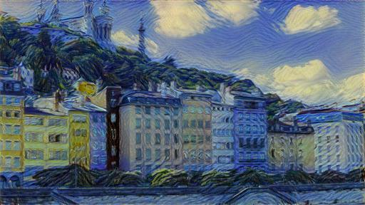
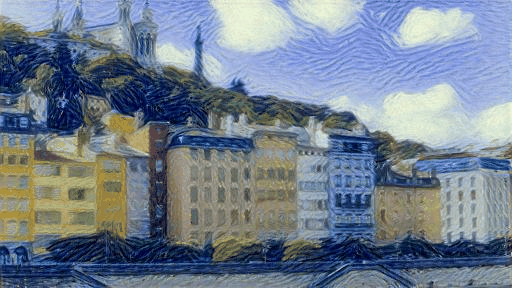

# Neural Style Transfer
A PyTorch implementation of "A Neural Algorithm of Artistic Style".

## Results

  
  
  

  

## References

[A Neural Algorithm of Artistic Style](https://arxiv.org/pdf/1508.06576.pdf)
