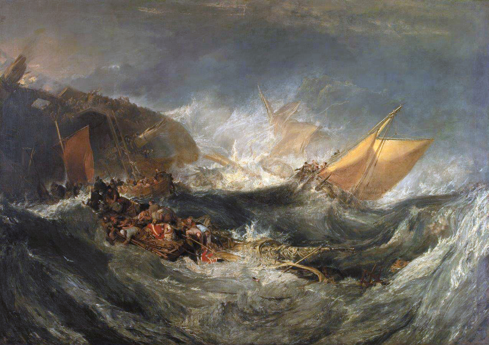
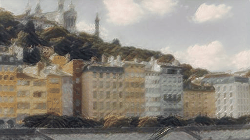

# Neural Style Transfer
A PyTorch implementation of "A Neural Algorithm of Artistic Style".

## Results

### Some examples

  
  
  

  
  
  

  
  
  

  
  
  

### Evolution

  
  
  
  

## References

[A Neural Algorithm of Artistic Style](https://arxiv.org/pdf/1508.06576.pdf)
